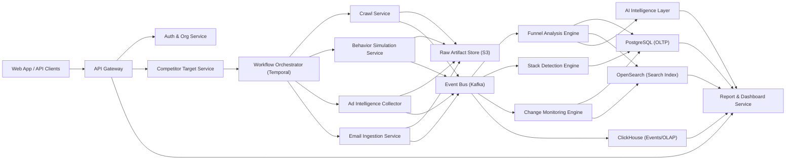
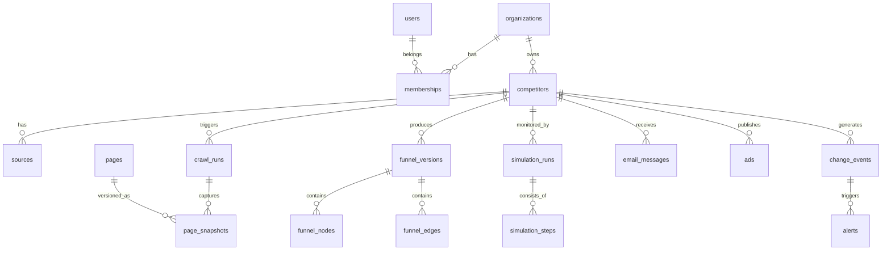

# Competitive Funnel Intelligence SaaS  
## Complete Engineering and Development Plan (Production-Grade)

Version: `1.0`  
Date: `2026-03-15`  
Document owner: `CTO / Platform Architecture`

---

## 1. Product Overview

### 1.1 Product Mission
Build a multi-tenant SaaS platform that continuously reconstructs and monitors public competitor funnels across web and social entry points (website, Instagram profile links, Facebook page links, ad libraries), then converts raw observations into actionable intelligence.

### 1.2 Core Value Proposition
The platform must answer, continuously:
- What is each competitor funnel structure right now?
- What changed since last week?
- Which ads/entry points connect to which landing pages/offers?
- Which technologies and tracking stack are being used?
- What strategic actions should the customer consider next?

### 1.3 Functional Scope
Input targets:
- Domain (`competitor.com`)
- Full URL (`https://competitor.com/offer`)
- Social profile/page URLs (Instagram/Facebook public profiles/pages)

Outputs:
- Funnel graph by competitor and by date version
- Timeline of funnel and pricing changes
- Ad-to-landing mapping
- Email sequence capture and analysis (from consented test identities)
- Marketing/analytics stack detection
- Alerts and AI-generated strategic reports

### 1.4 Product Constraints and Compliance Boundaries
- Collect only public or consent-based data (test inboxes/identities controlled by the platform).
- Respect jurisdictional requirements (privacy, data retention, terms of service).
- Do not bypass authentication walls or private user data.
- Maintain auditable evidence for every intelligence claim (URL, timestamp, snapshot, extraction trace, confidence score).

### 1.5 Non-Functional Requirements (NFRs)
- Availability: `99.9%` control plane, `99.5%` data collection plane.
- Freshness: high-priority targets rechecked in `<= 6h`; standard targets `<= 24h`.
- Traceability: 100% of reported insights linked to source artifacts.
- Multi-tenancy: strict tenant isolation at API, storage, and compute levels.
- Security: encryption in transit and at rest; least privilege service access.

---

## 2. Open Source Repository Research

Research was validated using GitHub metadata (stars/activity as of `2026-03-15`).  
Use these as building blocks, not as an unfiltered dependency list.

### 2.1 Crawler, Automation, Detection, and Intelligence Repositories

| Category | Repository | Link | Why Useful for This SaaS | Maintenance Signal |
|---|---|---|---|---|
| Web Crawling | `scrapy/scrapy` | [GitHub](https://github.com/scrapy/scrapy) | Mature Python crawling framework with robust extraction pipelines, retries, middleware, and ecosystem. Great for deterministic page collection. | ~60k stars, active 2026 |
| Web Crawling | `apify/crawlee` | [GitHub](https://github.com/apify/crawlee) | TypeScript-first crawler stack with browser + HTTP modes, autoscaling, session/proxy support. Strong fit for modern JS-heavy sites. | ~22k stars, active 2026 |
| Web Crawling | `gocolly/colly` | [GitHub](https://github.com/gocolly/colly) | High-performance Go crawler for lightweight broad scans and URL discovery stages. | ~25k stars, active 2026 |
| Web Crawling | `projectdiscovery/katana` | [GitHub](https://github.com/projectdiscovery/katana) | Fast crawling/spidering useful for discovery/frontier expansion and asset enumeration. | ~15k stars, active 2026 |
| Large-Scale Crawling | `apache/nutch` | [GitHub](https://github.com/apache/nutch) | Proven scalable crawler architecture; reference patterns for broad crawl management and extensibility. | ~3k stars, active 2026 |
| Large-Scale Crawling | `apache/stormcrawler` | [GitHub](https://github.com/apache/stormcrawler) | Real-time distributed crawling approach on stream processing, useful for event-driven crawl pipelines. | Active 2026 |
| Crawl Orchestration | `scrapy/scrapyd` | [GitHub](https://github.com/scrapy/scrapyd) | Daemonized spider deployment/execution model; useful as baseline for crawler job runner design. | Active 2026 |
| Crawl Distribution | `rmax/scrapy-redis` | [GitHub](https://github.com/rmax/scrapy-redis) | Redis-backed distributed queue/frontier for Scrapy workloads. Useful for queueing patterns and dedupe ideas. | Widely used |
| Browser Automation | `microsoft/playwright` | [GitHub](https://github.com/microsoft/playwright) | Best-in-class cross-browser automation with robust context isolation, traces, network hooks, and reliability. Core for simulation engine. | ~84k stars, active 2026 |
| Browser Automation | `puppeteer/puppeteer` | [GitHub](https://github.com/puppeteer/puppeteer) | Chromium-focused automation stack with deep ecosystem and plugin support. | ~93k stars, active 2026 |
| Browser Automation | `SeleniumHQ/selenium` | [GitHub](https://github.com/SeleniumHQ/selenium) | Standardized automation framework; useful for compatibility testing and fallback execution. | ~34k stars, active 2026 |
| Browser Infra | `browserless/browserless` | [GitHub](https://github.com/browserless/browserless) | Containerized headless browser infrastructure with queue/session management. Accelerates browser fleet operations. | ~12k stars, active 2026 |
| Fingerprint/Identity | `apify/fingerprint-suite` | [GitHub](https://github.com/apify/fingerprint-suite) | Browser fingerprint generation/injection tooling to create realistic identity profiles for simulation contexts. | Active 2026 |
| Stealth Tooling | `berstend/puppeteer-extra` | [GitHub](https://github.com/berstend/puppeteer-extra) | Plugin model for Puppeteer (including stealth plugins) with broad adoption. Useful for configurable browser behaviors. | ~7k stars |
| Stealth Tooling | `ultrafunkamsterdam/undetected-chromedriver` | [GitHub](https://github.com/ultrafunkamsterdam/undetected-chromedriver) | Browser automation hardening patterns against bot detection systems; useful as reference for resilience techniques. | ~12k stars |
| Stealth Tooling | `rebrowser/rebrowser-patches` | [GitHub](https://github.com/rebrowser/rebrowser-patches) | Patch-based approach to reduce automation leaks in Playwright/Puppeteer stacks. | Active ecosystem |
| Change Monitoring | `dgtlmoon/changedetection.io` | [GitHub](https://github.com/dgtlmoon/changedetection.io) | Mature webpage diff/monitoring concepts that map directly to funnel change alerts. | ~30k stars, active 2026 |
| Tech Fingerprinting | `projectdiscovery/wappalyzergo` | [GitHub](https://github.com/projectdiscovery/wappalyzergo) | Fast technology fingerprinting engine (Wappalyzer signatures in Go). Strong fit for stack detection service. | Active 2026 |
| Tech Fingerprinting | `urbanadventurer/WhatWeb` | [GitHub](https://github.com/urbanadventurer/WhatWeb) | Signature-based web stack and framework detection with plugin model. | ~6k stars |
| HTTP Probe Toolkit | `projectdiscovery/httpx` | [GitHub](https://github.com/projectdiscovery/httpx) | Multi-probe HTTP scanner (headers, TLS, titles, probes) useful in discovery and metadata extraction. | Active 2026 |
| Email Capture | `axllent/mailpit` | [GitHub](https://github.com/axllent/mailpit) | Modern SMTP sink and email testing API; excellent for controlled test inbox ingestion workflows. | ~8k stars, active 2026 |
| Email Capture | `mailhog/MailHog` | [GitHub](https://github.com/mailhog/MailHog) | Classic SMTP testing sink; useful as fallback and for ecosystem tooling compatibility. | ~15k stars |
| Email Infrastructure | `docker-mailserver/docker-mailserver` | [GitHub](https://github.com/docker-mailserver/docker-mailserver) | Production-ready self-hosted SMTP/IMAP stack for persistent inbound funnel email capture. | ~18k stars, active 2026 |
| Ad Intelligence APIs | `facebook/facebook-python-business-sdk` | [GitHub](https://github.com/facebook/facebook-python-business-sdk) | Official Meta Marketing API SDK; suitable for compliant ad data ingestion where API permissions allow. | Active 2026 |
| Ad Intelligence APIs | `googleads/google-ads-python` | [GitHub](https://github.com/googleads/google-ads-python) | Official Google Ads API client for compliant ad/metadata retrieval paths. | Active 2026 |
| Ad Intelligence APIs | `googleapis/google-api-python-client` | [GitHub](https://github.com/googleapis/google-api-python-client) | Broad official Google API client for integrations beyond ad account APIs where applicable. | ~8k stars, active 2026 |
| Ad Library Scraper | `Lejo1/facebook_ad_library` | [GitHub](https://github.com/Lejo1/facebook_ad_library) | Practical reference for public ad library collection patterns and data normalization. | Active 2026 |
| Workflow Orchestration | `temporalio/temporal` | [GitHub](https://github.com/temporalio/temporal) | Durable workflows for long-running simulations, retries, and exactly-once orchestration semantics. | ~18k stars, active 2026 |
| Event Streaming | `apache/kafka` | [GitHub](https://github.com/apache/kafka) | Core event backbone for decoupled pipelines, ingestion spikes, replay, and multi-consumer analytics. | ~32k stars, active 2026 |
| Distributed Compute | `ray-project/ray` | [GitHub](https://github.com/ray-project/ray) | Distributed execution for heavy parallel extraction/enrichment/ML workloads. | ~41k stars, active 2026 |
| Search/Index | `opensearch-project/OpenSearch` | [GitHub](https://github.com/opensearch-project/OpenSearch) | High-scale search and filtering over pages, ads, emails, and event metadata. | ~12k stars, active 2026 |
| OLAP Analytics | `ClickHouse/ClickHouse` | [GitHub](https://github.com/ClickHouse/ClickHouse) | Columnar analytics DB for event telemetry, historical comparisons, and benchmark queries. | ~46k stars, active 2026 |
| Vector Retrieval | `milvus-io/milvus` | [GitHub](https://github.com/milvus-io/milvus) | Vector database for semantic clustering of copy/creatives and AI retrieval workflows. | ~43k stars, active 2026 |

### 2.2 Recommended Adoption Strategy
- Build core collection on `Playwright + Crawlee + Kafka + Temporal`.
- Use `Scrapy/Colly/Katana` selectively for high-throughput discovery scans.
- Run stack detection with `wappalyzergo + WhatWeb + custom signatures`.
- Keep ad data collection compliant-first (official SDKs first, public sources second).
- Use `ClickHouse` for event analytics and `OpenSearch` for user-facing search.

---

## 3. Complete System Architecture

### 3.1 High-Level Service Topology

### 3.2 Service Definitions (Production Boundary)

1. `API Gateway`
- Single ingress for UI and external API.
- Enforces tenant auth, rate limiting, request tracing, quota control.

2. `Authentication & Authorization Service`
- SSO, RBAC, organization membership, API key issuance.
- Token introspection and service-level scopes.

3. `Competitor Target Service`
- Normalizes input targets (domain, URL, social profile/page).
- Maintains target graph and monitoring rules.

4. `Crawler Service`
- Distributed static and dynamic crawl jobs.
- Collects HTML, DOM snapshots, metadata, redirects, JS/network traces.

5. `Distributed Browser Automation Service`
- Runs stateful simulation sessions at scale.
- Supports persona/device profiles and persistent session contexts.

6. `Identity and Behavior Simulation Engine`
- Generates human-like action plans (scroll/click/wait/abandon/purchase path simulation).
- Controls path diversification and timing distributions.

7. `Email Ingestion Service`
- Provision and manage unique test inboxes.
- Ingests inbound emails, extracts links, templates, send cadence, offer changes.

8. `Funnel Analysis Engine`
- Page classification and stage mapping.
- Builds/version-controls funnel graph nodes/edges.

9. `Marketing Stack Detection Service`
- Signature matching on scripts, headers, cookies, endpoints, JS bundles.
- Generates confidence-scored tech detections.

10. `Ad Intelligence Collector`
- Ingests ad metadata from public sources and approved APIs.
- Links ad creatives/copy to landing pages and funnel branches.

11. `Competitor Monitoring Engine`
- Diffs snapshots and graph versions.
- Emits change events and alert candidates.

12. `AI Intelligence Layer`
- Summarization, gap analysis, strategic suggestions with evidence citations.
- Produces narrative reports and opportunity scoring.

13. `Reporting & Visualization Service`
- Funnel map UI, timelines, comparative dashboards, export APIs.

### 3.3 End-to-End Data Pipeline

1. User adds competitor target.
2. Target Service normalizes and stores source endpoints.
3. Temporal starts discovery workflow.
4. Crawler discovers candidate funnel pages and emits events.
5. Simulation engine runs persona workflows and captures state transitions.
6. Email ingestion receives campaign emails and extracts structured data.
7. Ad collector ingests ad units and associates entry URLs/UTMs.
8. Stack detector identifies technologies and trackers per page snapshot.
9. Funnel analysis reconstructs graph version and confidence.
10. Monitoring engine compares latest vs prior version.
11. Alerting service sends prioritized alerts.
12. Reporting service materializes dashboards and periodic intelligence reports.

### 3.4 Event Taxonomy (Kafka Topics)
- `target.created`
- `crawl.run.started`, `crawl.page.captured`, `crawl.run.completed`
- `simulation.run.started`, `simulation.step.completed`, `simulation.run.completed`
- `email.message.ingested`, `email.link.extracted`
- `ad.creative.ingested`, `ad.landing.linked`
- `stack.detected`
- `funnel.version.created`
- `change.detected`
- `alert.triggered`
- `report.generated`

### 3.5 Reliability Patterns
- Temporal workflows for retries/compensation/long-running state.
- Idempotency keys for all ingestion writes.
- Dead-letter queues for failed parse/classification events.
- Backpressure using Kafka lag + KEDA autoscaling.
- Circuit breakers for unstable targets/proxies.

---

## 4. Technology Stack

### 4.1 Frontend
- `Next.js (React, TypeScript)`: fast SSR/ISR dashboards and authenticated app pages.
- `TanStack Query + GraphQL/REST`: efficient data fetching and cache consistency.
- `React Flow + D3`: funnel graph visualization and change overlays.
- `Tailwind + component system`: predictable UI velocity for enterprise dashboards.

Reasoning: large data UI, graph-heavy interactions, SSR for report pages and shareable links.

### 4.2 Backend and Platform Services
- `NestJS (TypeScript)` for control-plane APIs (orgs, billing, reporting, permissions).
- `Go` services for high-throughput crawlers and detection probes.
- `Python` services for NLP/LLM preprocessing and advanced analysis.

Reasoning: polyglot split by workload profile (API ergonomics, network throughput, ML ecosystem).

### 4.3 Browser Automation and Crawling
- `Playwright` as default simulation runtime.
- `Crawlee` for robust queue/session/proxy orchestration in JS.
- `Colly/Katana` optional high-speed discovery workers.
- `Browserless` compatible browser pools in Kubernetes.

Reasoning: reliability on JS-heavy sites and scalable browser fleet management.

### 4.4 Workflow and Task Orchestration
- `Temporal` for durable business workflows.
- `Kafka` for event streaming and decoupled processing.
- `Redis` for hot cache, short-lived coordination, and low-latency locks.

Reasoning: Temporal handles long-running state; Kafka handles throughput and replay.

### 4.5 Databases and Storage
- `PostgreSQL` (OLTP, tenant entities, graph versions, alerts, permissions).
- `ClickHouse` (high-volume event analytics and benchmark queries).
- `OpenSearch` (fast search/filter across pages/emails/ads/extracted copy).
- `S3-compatible object storage` (HTML, screenshots, HAR, email raw MIME, artifacts).
- `Milvus` or `pgvector` (semantic similarity and creative clustering).

Reasoning: no single DB fits OLTP + event analytics + text search + artifact storage.

### 4.6 AI/ML Layer
- LLM orchestration service with prompt templates and guardrails.
- Embedding pipeline for creative/copy clustering and retrieval.
- Model registry and evaluation store for classifier versions.

Reasoning: required for explainable intelligence outputs with reproducibility.

### 4.7 Cloud and Infrastructure
- `Kubernetes` for multi-service deployment and autoscaling.
- `KEDA` for event-driven worker scaling.
- `Terraform` for reproducible infrastructure.
- `Argo CD` for GitOps deployment.
- `Cloudflare`/WAF at edge for API protection.

### 4.8 Observability and Operations
- `OpenTelemetry` instrumentation.
- `Prometheus + Grafana` metrics dashboards.
- `Loki` or `ELK/OpenSearch` logs.
- `Jaeger/Tempo` distributed tracing.
- `Sentry` for app/runtime exceptions.

---

## 5. Core System Modules

### 5.1 Funnel Discovery Engine
Responsibilities:
- Crawl targets and discover candidate funnel pages.
- Extract links/forms/CTA graph.
- Produce initial stage candidates.

Inputs:
- Target URLs, crawl policy, robots and domain constraints.

Outputs:
- Normalized pages, link graph edges, discovery metadata.

### 5.2 Behavior Simulation Engine
Responsibilities:
- Execute persona-based browsing workflows over time.
- Simulate key behaviors (engage, abandon, return, convert path where legal/possible).
- Capture state transitions and remarketing exposure windows.

Inputs:
- Persona templates, scenario scripts, schedule windows, proxy policy.

Outputs:
- Session traces, step events, screenshot/video artifacts, cookies/local storage metadata.

### 5.3 Email Intelligence Engine
Responsibilities:
- Generate and manage unique identity inboxes.
- Ingest email campaigns and sequence timelines.
- Parse copy/CTA/offer deltas and automation cadence.

Outputs:
- Structured email sequence entities and linked funnel nodes.

### 5.4 Ad Intelligence Engine
Responsibilities:
- Collect ad data from public/approved sources.
- Normalize creatives, ad text, CTA, destination URLs.
- Correlate ad entries to landing pages/funnels.

Outputs:
- Ad objects, creative assets, ad-to-funnel linkage confidence.

### 5.5 Stack Detection Engine
Responsibilities:
- Detect technologies (commerce, analytics, pixels, automation tools).
- Track script-level and vendor-level changes across snapshots.

Outputs:
- Technology detections with confidence and evidence trace.

### 5.6 Change Monitoring Engine
Responsibilities:
- Compare versioned pages/funnel graphs.
- Detect meaningful changes (pricing, offer structure, CTA, sequence expansion).
- Trigger alerts with severity scoring.

Outputs:
- Change events and alert recommendations.

### 5.7 Funnel Reconstruction Engine
Responsibilities:
- Merge crawl/simulation/email/ad evidence into a coherent funnel graph.
- Version graph over time and maintain confidence per node/edge.

Outputs:
- `funnel_version`, `funnel_node`, `funnel_edge`, `evidence_refs`.

### 5.8 Competitive Intelligence Engine
Responsibilities:
- Compare target company vs competitor set.
- Generate strategic gaps and opportunity hypotheses.
- Build benchmark indicators from observed sample distributions.

Outputs:
- Insight cards, priority scores, confidence, supporting evidence.

### 5.9 Reporting and Visualization Layer
Responsibilities:
- Render funnel maps, timelines, ad library and sequence views.
- Produce scheduled PDF/HTML intelligence reports.
- Expose alert center and notification feeds.

---

## 6. Database Architecture

### 6.1 Storage Model by Data Type
- `PostgreSQL`: tenancy, config, normalized entities, graph versions, alerts, report metadata.
- `ClickHouse`: immutable high-volume event streams and analytical aggregates.
- `OpenSearch`: full-text search, filtering, and faceted exploration.
- `S3`: raw artifacts and evidence payloads.
- `Vector store`: embeddings for semantic retrieval and clustering.

### 6.2 Core Relational Schema (PostgreSQL)

#### Identity and Tenancy
- `organizations(id, name, plan, status, created_at)`
- `users(id, email, auth_provider_id, status, created_at)`
- `memberships(org_id, user_id, role, created_at)`
- `api_keys(id, org_id, key_hash, scopes, created_at, revoked_at)`

#### Competitor Targeting
- `competitors(id, org_id, display_name, primary_domain, status, created_at)`
- `sources(id, competitor_id, source_type, normalized_url, platform, active, created_at)`
- `monitoring_policies(id, competitor_id, cadence, priority, depth, geo_profile, device_profile, created_at)`

#### Crawl and Page Assets
- `crawl_runs(id, competitor_id, source_id, run_type, started_at, completed_at, status)`
- `pages(id, competitor_id, canonical_url, url_hash, first_seen_at, last_seen_at)`
- `page_snapshots(id, page_id, crawl_run_id, content_hash, html_s3_key, screenshot_s3_key, status_code, captured_at)`
- `page_links(id, from_snapshot_id, to_url_hash, anchor_text, rel, discovered_at)`

#### Funnel Graph
- `funnel_versions(id, competitor_id, version_no, valid_from, valid_to, confidence_score, created_at)`
- `funnel_nodes(id, funnel_version_id, node_type, page_id, label, price_value, currency, confidence_score, created_at)`
- `funnel_edges(id, funnel_version_id, from_node_id, to_node_id, edge_type, confidence_score, created_at)`
- `node_evidence(id, node_id, evidence_type, ref_table, ref_id, weight, created_at)`

#### Simulation and Identity
- `simulation_profiles(id, org_id, name, device_type, locale, risk_profile, created_at)`
- `sim_identities(id, org_id, profile_id, email_alias, phone_alias, proxy_pool_id, created_at)`
- `simulation_runs(id, competitor_id, profile_id, identity_id, scenario_type, started_at, ended_at, status)`
- `simulation_steps(id, run_id, step_order, action_type, target_url, result, latency_ms, artifact_ref, created_at)`

#### Email Intelligence
- `inboxes(id, org_id, address, provider, status, created_at)`
- `email_messages(id, inbox_id, competitor_id, subject, from_domain, received_at, raw_mime_s3_key, body_text, body_html_s3_key)`
- `email_links(id, message_id, url, normalized_url, utm_json, linked_page_id, created_at)`
- `email_sequences(id, competitor_id, identity_id, first_message_at, last_message_at, message_count, pattern_signature, created_at)`

#### Ad Intelligence
- `ads(id, competitor_id, platform, ad_external_id, status, first_seen_at, last_seen_at)`
- `ad_creatives(id, ad_id, creative_type, headline, body_text, media_s3_key, cta, landing_url, created_at)`
- `ad_observations(id, ad_id, observed_at, region, language, spend_range, impression_range)`
- `ad_to_funnel_links(id, ad_id, funnel_node_id, confidence_score, linked_at)`

#### Stack Detection
- `technology_catalog(id, vendor, product, category, signature_version)`
- `technology_detections(id, snapshot_id, technology_id, confidence_score, detection_method, detected_at)`
- `tracking_scripts(id, snapshot_id, script_url, vendor_guess, script_hash, detected_at)`

#### Monitoring and Alerts
- `change_events(id, competitor_id, change_type, severity, old_value_json, new_value_json, detected_at, evidence_ref)`
- `alert_rules(id, org_id, rule_name, rule_json, channel_config_json, active, created_at)`
- `alerts(id, org_id, competitor_id, change_event_id, severity, status, created_at)`
- `alert_deliveries(id, alert_id, channel, delivered_at, delivery_status, provider_ref)`

#### Reporting
- `reports(id, org_id, report_type, period_start, period_end, status, generated_at, artifact_s3_key)`
- `report_sections(id, report_id, section_key, content_json, confidence_score)`

### 6.3 Event Warehouse Schema (ClickHouse)
- `event_stream(org_id, competitor_id, event_type, event_time, source_service, payload_json, trace_id)`
- Partition by month (`toYYYYMM(event_time)`), order by (`org_id`, `competitor_id`, `event_time`).
- Materialized views:
  - `daily_competitor_changes`
  - `email_sequence_metrics`
  - `ad_activity_metrics`
  - `funnel_transition_metrics`

### 6.4 Search Indexing (OpenSearch)
Indices:
- `pages-index`
- `emails-index`
- `ads-index`
- `changes-index`
- `reports-index`

Each document stores:
- tenant/org IDs
- normalized metadata
- extracted text fields
- artifact pointers
- confidence and evidence references

### 6.5 Entity Relationship Summary

---

## 7. Distributed Crawling Infrastructure

### 7.1 Runtime Topology
- `Control Plane Cluster`:
  - API gateway
  - auth/org services
  - reporting/query APIs
  - Temporal frontend/history/matching
- `Data Plane Cluster`:
  - crawl workers
  - browser simulation workers
  - email ingestion workers
  - ad collectors
  - AI enrichment workers

### 7.2 Worker Types
- `Discovery Workers` (HTTP-first, high-throughput).
- `Dynamic Render Workers` (headless browser required pages).
- `Simulation Workers` (stateful persona sessions).
- `Ingestion Workers` (email/ad feed ingestion).
- `Enrichment Workers` (classification, detection, linking).

### 7.3 Orchestration and Scheduling
- Temporal workflow types:
  - `InitialDiscoveryWorkflow`
  - `DailyMonitoringWorkflow`
  - `PersonaSimulationWorkflow`
  - `EmailSequenceFollowWorkflow`
  - `WeeklyReportWorkflow`
- Trigger sources:
  - cron schedules by competitor priority
  - event-driven triggers after detected changes
  - manual user actions

### 7.4 Running Thousands of Simulated Users
- Browser pool with context isolation per run.
- Session state persisted per identity (cookies/storage profile).
- Proxy/session affinity to preserve realistic continuity.
- Scenario randomization with deterministic seeds for reproducibility.
- Horizontal autoscaling based on:
  - queued runs
  - average run latency
  - block/error rate

### 7.5 Long-Running Monitoring Jobs
- Workflow heartbeats every step.
- Continue-as-new in Temporal for long histories.
- Checkpoint artifacts after each major stage.
- Resume from checkpoints after infra failures.

### 7.6 Infrastructure Components
- Kubernetes node pools:
  - CPU pool (crawler/extraction)
  - Memory pool (browser sessions)
  - GPU optional pool (vision/OCR/ML inference)
- Containerization:
  - Distroless images
  - immutable build tags
  - SBOM and vulnerability scanning
- Service mesh (optional):
  - mTLS internal traffic
  - traffic policy and retries

### 7.7 Scaling Controls
- KEDA autoscaling on Kafka lag and Temporal queue depth.
- Per-tenant fairness quotas.
- Priority queue classes (`critical`, `high`, `normal`, `bulk`).
- Cost-aware scheduler (limits expensive browser workloads).

---

## 8. Anti-Bot and Stealth Strategies

This section is designed for resilient collection while maintaining compliance and platform safety.

### 8.1 Policy-First Collection Guardrails
- Enforce source policy engine per platform/domain.
- Respect robots and legal constraints where required.
- No credential stuffing, no private-area bypass, no CAPTCHA bypass automation in protected flows.
- Keep auditable logs for every request source and identity used.

### 8.2 IP and Network Strategy
- Managed proxy pools with geographic diversity.
- Sticky sessions for realistic repeat visits.
- Adaptive retry backoff and domain-level concurrency limits.
- Automatic quarantine of burned IPs based on block heuristics.

### 8.3 Fingerprint and Session Strategy
- Device profile catalog (desktop/mobile families).
- Browser context randomization within realistic bounds.
- Locale/timezone/language consistency per identity.
- Persistent cookies and revisit cadences for remarketing observation.

### 8.4 Human-Like Navigation Patterns
- Probabilistic wait-time distributions.
- Non-linear scroll and interaction trajectories.
- Session depth variability (quick bounce vs deep exploration).
- Return-visit schedules across days/weeks.

### 8.5 Detection of Blocking and Degradation
- Block page classifier (captcha/challenge/deny patterns).
- Real-time block-rate metrics by domain and proxy pool.
- Automatic policy downgrade from dynamic simulation to passive monitoring when needed.

### 8.6 Abuse Prevention and Ethics Controls
- Tenant-level usage governance.
- Domain allow/deny lists.
- Kill-switch for suspicious campaign patterns.
- Human review workflow for high-risk target requests.

---

## 9. Scalability Architecture

### 9.1 Expected Scale Targets (Production)
- `10,000+` competitors tracked.
- `5M+` page snapshots/month.
- `100k+` simulation sessions/day (burst-capable).
- `10M+` events/day in ClickHouse.
- `100TB+` long-term artifact storage.

### 9.2 Horizontal Scaling Strategy
- Stateless API services scaled by CPU/RPS.
- Worker pools scaled by queue depth and SLA priority.
- Kafka partition scaling by topic throughput and consumer groups.
- ClickHouse cluster scaling by sharding + replication.

### 9.3 Storage Optimization
- Content-hash deduplication for HTML/asset bodies.
- Delta compression for snapshot versions.
- Tiered storage:
  - hot (30 days): immediate query
  - warm (180 days): analytical access
  - cold (archive): cheap object storage
- TTL policies for low-value raw artifacts while retaining derived intelligence.

### 9.4 Caching and Query Performance
- Redis cache for hot dashboards and competitor summary cards.
- Pre-aggregated materialized views in ClickHouse.
- OpenSearch index lifecycle management and rollover policies.
- Read replicas for PostgreSQL query-heavy endpoints.

### 9.5 Pipeline Throughput Controls
- Event schema versioning and contract enforcement.
- Batch + stream hybrid ingestion.
- Backpressure propagation from sinks to collectors.
- DLQ replay tooling and reprocessing jobs.

### 9.6 Resilience and Disaster Recovery
- Multi-AZ deployment for core services.
- Point-in-time recovery for PostgreSQL.
- Snapshot backups for ClickHouse and OpenSearch.
- Cross-region artifact replication for S3.
- Recovery runbooks with tested RTO/RPO objectives.

---

## 10. Reporting and Intelligence Layer

### 10.1 Funnel Maps
- Interactive graph per competitor and per date version.
- Node types: ad entry, landing, lead magnet, webinar, product, checkout, upsell, thank-you, retention.
- Edge confidence with evidence drill-down.

### 10.2 Competitor Reports
Report structure:
- Executive summary of key changes
- Funnel map delta (current vs previous period)
- Ad/creative activity summary
- Email sequence insights
- Technology stack changes
- Recommended actions (evidence-backed)

Formats:
- In-app dashboards
- Scheduled email digests
- PDF/HTML exports
- API JSON for BI integration

### 10.3 Alerting System
Alert types:
- New offer or price change
- New landing page or funnel branch
- New ad creative burst
- New email sequence detected
- Stack technology change

Delivery channels:
- In-app
- Slack
- Email
- Webhook

### 10.4 AI-Generated Strategic Insights
- Compare customer funnel maturity vs competitor cohort.
- Highlight missing funnel components.
- Prioritize hypotheses by estimated impact and confidence.
- Every insight must cite evidence references (snapshots/emails/ads/events).

### 10.5 Confidence and Explainability Framework
- Per-entity confidence scores from multi-signal fusion.
- Explainability card:
  - source artifacts
  - extraction methods
  - model versions
  - timestamp lineage

### 10.6 Quality Controls
- Precision/recall tracking for page-stage classification.
- False-positive monitoring for change alerts.
- Human-in-the-loop review for low-confidence high-impact alerts.

---

## 11. Future System Evolution

### 11.1 Engineering Roadmap (Production Program)

#### Phase 1 (`Months 0-3`) Platform Foundation
- Multi-tenant auth/org model
- Target management and monitoring policies
- Basic crawl + snapshot pipeline
- Artifact storage and event bus
- Initial dashboard skeleton

Exit criteria:
- Stable ingestion for 1,000 targets/day
- Foundational observability and SLO dashboard live

#### Phase 2 (`Months 3-6`) Funnel Discovery + Change Intelligence
- Funnel page classification and versioned graph
- Diff engine for page/funnel changes
- Alert pipeline + Slack/email delivery
- Search index over snapshots and changes

Exit criteria:
- Automated funnel reconstruction for majority of monitored domains
- Actionable alert precision target achieved

#### Phase 3 (`Months 6-9`) Behavior Simulation + Email Intelligence
- Persona simulation engine at scale
- Identity/inbox lifecycle service
- Email ingestion and sequence analysis
- Remarketing observation windows

Exit criteria:
- Continuous simulation for top-tier competitors
- Email sequence extraction integrated into funnel graph

#### Phase 4 (`Months 9-12`) Ad Intelligence + AI Analyst
- Ad data ingestion and normalization
- Ad-to-landing and ad-to-funnel linking
- AI insight generation with evidence citations
- Weekly strategic report automation

Exit criteria:
- Full intelligence report pipeline (funnel + ads + email + stack)
- Customer-facing strategic recommendations

#### Phase 5 (`Months 12-18`) Enterprise Scale and Platformization
- RBAC hardening, audit logs, SSO/SCIM
- API products for partner integrations
- Cost-aware scheduler and quota controls
- Advanced benchmarking and cohort analytics

Exit criteria:
- Enterprise readiness (security/compliance controls)
- 10k+ competitors at predictable unit economics

### 11.2 Team Topology by Maturity Stage
- Early stage:
  - 1 Staff/Principal Architect
  - 3-4 Backend/Data Engineers
  - 2 Automation Engineers
  - 1 Frontend Engineer
  - 1 ML Engineer
  - 1 DevOps/SRE
- Growth stage:
  - Dedicated platform team
  - Dedicated intelligence/ML team
  - Dedicated reliability and compliance squad

### 11.3 Testing and Release Strategy
- Unit + integration + contract tests for all event schemas.
- Synthetic target environments for regression testing.
- Canary releases by tenant cohort.
- Chaos testing for worker failures and queue outages.

### 11.4 Governance and Compliance Evolution
- Policy engine updates per platform/legal changes.
- Data retention controls configurable by tenant.
- Secure evidence access controls and auditability.

### 11.5 North-Star Product Metrics
- `Time-to-first-intelligence` (TTFI)
- Alert precision and actionable rate
- Weekly active analyst users
- Intelligence report open/click-to-action rate
- Net revenue retention and expansion by monitored competitor count

---

## Appendix A: Suggested Service Interfaces (Initial)

- `POST /v1/competitors`
- `POST /v1/competitors/{id}/monitoring-policy`
- `POST /v1/competitors/{id}/run/discovery`
- `POST /v1/competitors/{id}/run/simulation`
- `GET /v1/competitors/{id}/funnel/latest`
- `GET /v1/competitors/{id}/changes?from=&to=`
- `GET /v1/competitors/{id}/ads`
- `GET /v1/competitors/{id}/emails`
- `GET /v1/reports/{id}`
- `POST /v1/alerts/rules`

## Appendix B: Key Build/Buy Decisions

- Build:
  - Funnel reconstruction graph model
  - Multi-source evidence fusion
  - Competitive insight scoring
- Buy/Managed:
  - Proxy providers
  - Commodity observability layers
  - Managed Kafka/ClickHouse/OpenSearch where cost-effective

## Appendix C: Delivery Principle

This SaaS should be engineered as an `intelligence platform`, not just a scraper fleet:
- durable workflows,
- evidence-linked analytics,
- explainable AI outputs,
- and enterprise-grade reliability/compliance from day one.
